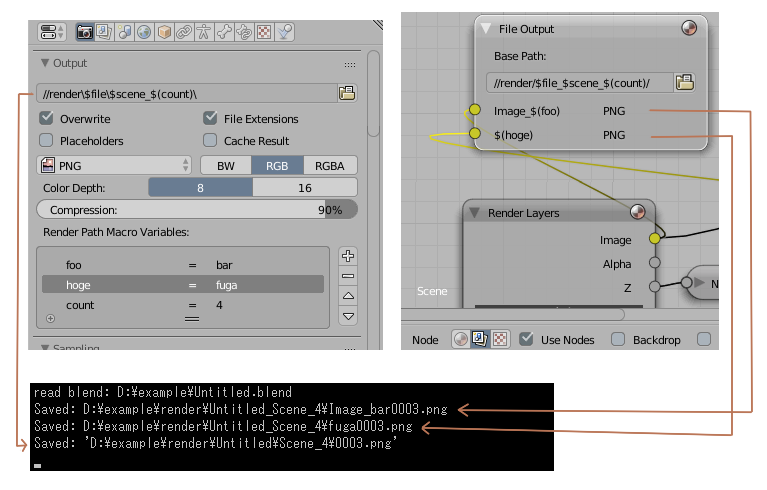
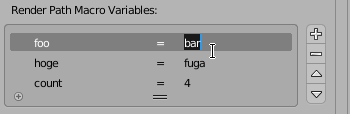

# Enable Macro Render Output Path

Apply macro syntax to render output filepaths

## Installation

1. Download the `render_enable_macro_path.py`
2. Blender > Preferences > Install from file > Select the file

## Usage

### Replacing paths

* While this addon is enabled, Render Paths are automatically replaced at start/end of rendering.
* The target paths are `Properties > Render Settings > Output`, `Compositing Nodes > File Output Node`'s `Base Path` and its `File Subpaths`.

### Path Macro Words

There are several macro words. If the path contained these words, they will be replaced to other words at rendering.  
> *e.g.*  
> `d:/bl_render_out/$file/$scene/` => `d:/bl_render_out/Untitled/Scene/`  
> `//render/$file_$scene_$camera_$(foobar)/` => `//render/Untitled_Scene_Camera_baz/`

* `$file` : The blender file name opening in present
* `$scene` : Scene name
* `$camera` : Active camera name
* `$(<variable-name>)` : A user defined macro variable (see below)

### Macro Variables

The `Render Path Macro Variables` panel exists in `Properties > Render Settings > Output`. it can define `Macro Variables`.  
For example, if a variable is set as `foo = bar`, word `$(foo)` in the paths will be replaced to `bar` at rendering.
